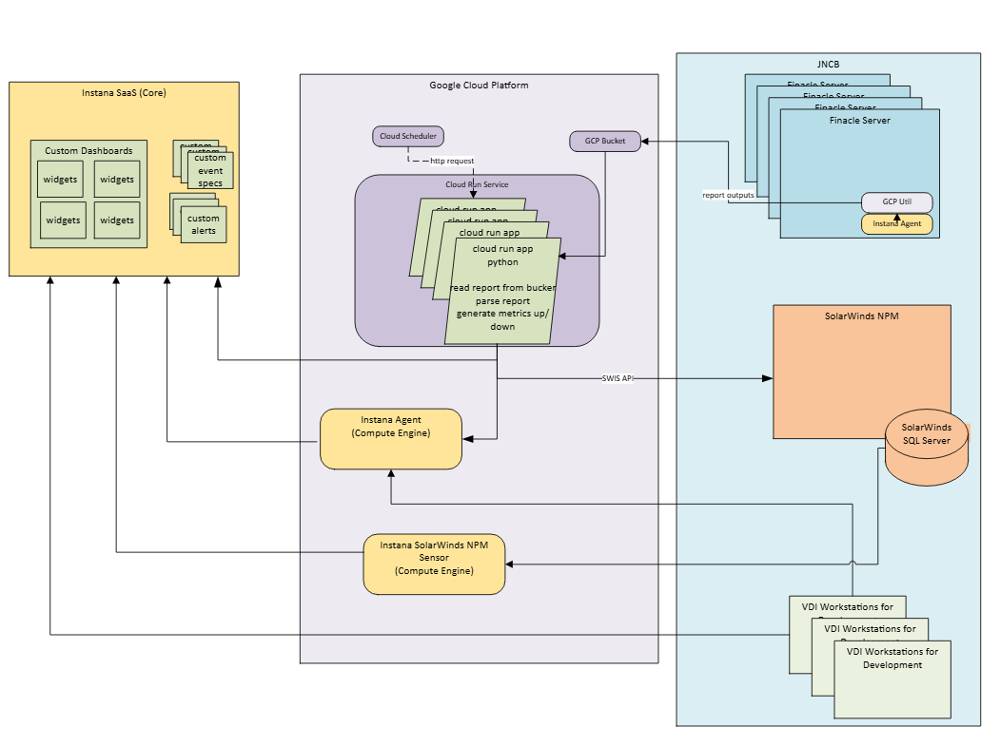
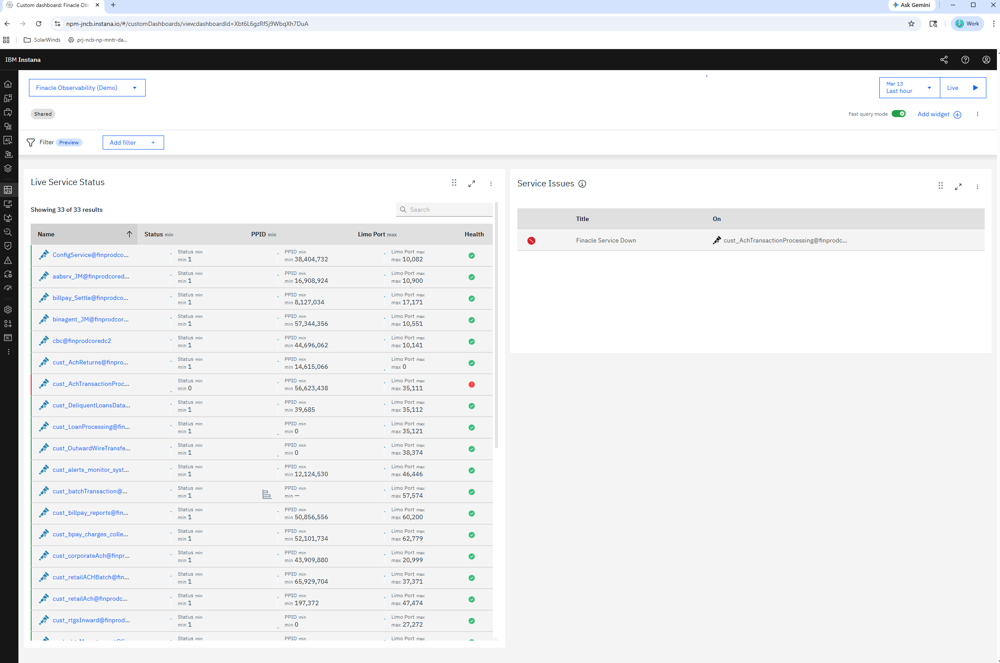
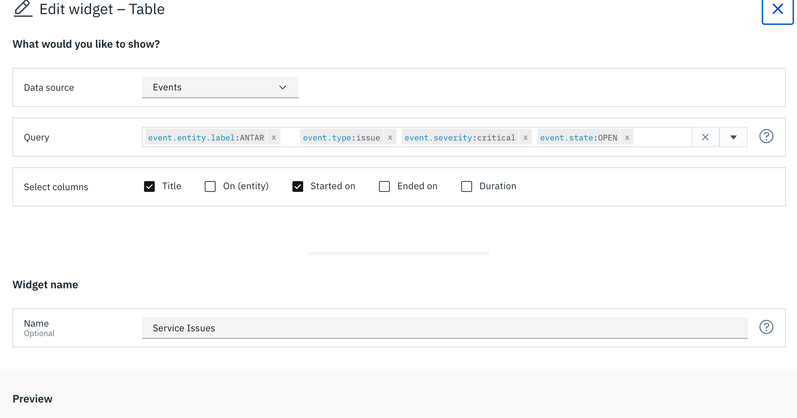

# Finacle Server Status

A Python-based monitoring system that tracks server/service status, uploads data to Google Cloud Storage, and integrates with Instana for dashboard visualization and alerting.

## Overview

This project consists of two main components:

1. **storebucket.py** - Continuously uploads service status files to Google Cloud Storage. This is for testing
2. **process_server_status_events.py** - Reads status data from GCS, updates Instana dashboards, and manages service alerts/events
3. **process_server_status_entities.py** - Reads status data from GCS, updates Instana dashboards, sends metrics which then cause aleerts to trigger

## Features

- 📊 **Real-time Service Monitoring** - Tracks service status (Up/Down) with process and port information
- ☁️ **Cloud Storage Integration** - Uploads status data to Google Cloud Storage buckets
- 📈 **Instana Dashboard Updates** - Automatically updates custom Instana dashboards with formatted service status tables
- 🚨 **Event Management** - Creates and closes Instana events based on service status changes
- 🔄 **Continuous Monitoring** - Runs in a loop to provide ongoing monitoring capabilities
- 🌐 **REST API** - Exposes endpoints for manual triggering and health checks

## Prerequisites

- Python 3.x
- Google Cloud Platform account with Storage API enabled
- Instana monitoring instance with API access
- Required Python packages:
  - `google-cloud-storage`
  - `requests`
  - `flask`
  - `python-dotenv`

## Installation

1. Clone this repository
2. Install required dependencies:
   ```bash
   pip install google-cloud-storage requests flask python-dotenv
   ```
3. Set up Google Cloud credentials (see Configuration section)
4. Configure environment variables in `.env` file

## Configuration

### Environment Variables

Create a `.env` file with the following variables:

```bash
# Google Cloud Storage
BUCKET_NAME=your-bucket-name
BUCKET_FILE_PATH=serviceChk_finprodcoredc2.txt
PROJECT_NAME=your-gcp-project-id

# Instana Configuration
BASE_URL=https://your-instance.instana.io
API_TOKEN=your-instana-api-token
DASHBOARD_NAME=Finacle Monitor
WIDGET_NAME=finprodcoredc2 Service Status
AGENT_URL=http://your-agent-url:4001  -- basic instana agent port
OTLP_AGENT_URL=http://172.16.0.70:4000 -- the OLTP port on the instana agent
EVENT_DURATION=3600000 - the amount of time that a event will stay OPEN for
FINACLE_HOST=finprodcoredc2

```

# Control parameters

```bash
MAX_SCHEDULED_INTERVAL_IN_MILLIS=600000 - the interval at which the scheduler will run (controls event cleanup). It should be greater than actual interval
AS_ENDPOINT=False - Allows it to act as a REST endpoint
LOOP_PAUSE_IN_SECONDS=-1 - Positive means it loops pausing this many seconds, negative means it only executes once
USE_LOCAL_FILE_INSTEAD_OF_BUCKET_PATH='test/demo/serviceChk_finprodcoredc.txt' - if this is set it reads the local file and not the bucket file
SKIP_EVENT_GENERATION=True -- if you want to not send out events and just want to gen the dashboard

```

### Google Cloud Authentication!

Set the `GOOGLE_APPLICATION_CREDENTIALS` environment variable to point to your service account key file:

x```bash
export GOOGLE_APPLICATION_CREDENTIALS="/path/to/your/service-account-key.json"

````

## Setup

Before you can run the process_server_status_entities.ps you need to set up information
in the instana server.
Please call the following urls with the following bodies:

1. entity type - create the finacle server entity type
   POST https://<instana tenant>.instana.io/api/custom-entitytypes
   JSON BODY: setup/createentitytype.json
2. event specification - this adds the spec that will create an event when a server is down
   POST https://<instana tenant>.instana.io/api/events/settings/event-specifications/custom
   JSON BODY: setup/createeventspec.json
3. dashboard
   POST https://npm-jncb.instana.io/api/custom-dashboard/
   JSON BODY: setup/createdashboard.json

You must pass Auhtorization: apiToken <instanaApiToken> in the headers

## Usage

### Upload Service Status to GCS

Run the storage uploader to continuously upload status files:

```bash
python upload_demo_server_status_file.py
````

This script will upload `serviceChk_finprodcoredc2.txt` to the configured GCS bucket every 5 seconds.

### Update Instana Dashboard

Run the dashboard updater to process status data and update Instana:

```bash
python process_server_status_events.ph

or

python process_server_status_entities.ph

```

This script will:

- Read the Text file from GCS
- Parse service status information
- Update the Instana dashboard with a formatted markdown table
- Create events for services that are down
- Close events for services that are back up

### REST API Endpoints

When running as a Flask application, the following endpoints are available:

- `GET /hello?name=World` - Simple health check endpoint
- `GET /api/v1/service/status` - Manually trigger dashboard update and return results

Start the Flask server:

```bash
python process_server_status_events.ph
```

The server will run on `http://0.0.0.0:5555`

## File Structure

- `upload_demo_server_status_file.py` - GCS upload script
- `process_server_status_events.ph` - Main dashboard update and event management script
- `test/demo/serviceChk_finprodcoredc2.txt` - Service status input file
- `.env` - Environment configuration (not tracked in git)

## Service Status Format

The service status file should contain the following columns:

| Service Name | Status | PPID  | Limo Port |
| ------------ | ------ | ----- | --------- |
| ServiceA     | Up     | 12345 | 8080      |
| ServiceB     | Down   | 12346 | 8081      |

Services marked as "Down" or "Offline" will be highlighted in bold on the dashboard and trigger critical events.

## Event Management

The system automatically manages Instana events:

- **Service Down**: Creates a severity 10 (critical) event with suffix "is Offline"
- **Service Up**: Creates a severity -1 (resolution) event with suffix "is Online"
- **Event Lifecycle**: Automatically closes stale events when service status changes

## Alert Mechanics

The system implements intelligent alert management through Instana events, providing real-time notifications when services go down and automatically resolving alerts when services recover.

### How Alerts Work

**Event Creation:**

- When a service is detected as **Down** or **Offline**, the system creates a critical severity event (severity 10) in Instana
- Each event is titled with the service name followed by "is Offline" (e.g., "finprodcoredc2.ServiceA is Offline")
- Events include detailed information: service name, PPID, Limo Port, and timestamp
- Events have a configurable duration (default: 1 hour / 3600000ms) set via `EVENT_DURATION` environment variable

**Event Resolution:**

- When a service comes back **Up**, the system automatically closes any open "is Offline" events for that service
- Resolution is performed by calling Instana's manual close API with the reason "Issue resolved. Service back online"
- The system can also create positive "is Online" events (severity -1) to explicitly mark service recovery

**Event Lifecycle Management:**

- The system queries Instana for all open events within a 2x duration window to track active alerts
- Events are categorized by service name and status (offline vs online)
- **Event Replacement:** When an event is about to expire (within `MAX_SCHEDULED_INTERVAL_IN_MILLIS`), the system:
  1. Identifies events nearing expiration
  2. Closes the expiring event
  3. Creates a new event to maintain continuous alerting for services that remain down
  4. Preserves the original start time and description to maintain alert history

**Alert Deduplication:**

- Before creating a new "is Offline" event, the system checks if an open event already exists for that service
- If an open event exists and is not expiring soon, no new event is created (prevents duplicate alerts)
- Only creates replacement events when existing ones are about to expire

**Configuration Parameters:**

- `EVENT_DURATION`: How long an event stays open (in milliseconds)
- `MAX_SCHEDULED_INTERVAL_IN_MILLIS`: Threshold for determining when to replace expiring events (should be greater than actual execution interval)
- `AGENT_URL`: Instana agent endpoint for sending events
- `FINACLE_HOST`: Hostname prefix added to service names in event titles

### Alert Flow Example

1. **Service Goes Down:**
   - System detects "ServiceA" status = "Down"
   - Creates event: "finprodcoredc2.ServiceA is Offline" (severity 10)
   - Event will auto-expire in 1 hour unless replaced

2. **Service Stays Down (Event Refresh):**
   - After 50 minutes, system detects event will expire soon
   - Closes the expiring event
   - Creates new event with same title and original start time
   - Maintains continuous alerting without gaps

3. **Service Recovers:**
   - System detects "ServiceA" status = "Up"
   - Closes the open "is Offline" event
   - Optionally creates "is Online" event (severity -1)
   - Alert is resolved in Instana

This intelligent alert mechanism ensures that operations teams are immediately notified of service outages while avoiding alert fatigue from duplicate notifications.

## Cloud Run Deployment

This application can be deployed to Google Cloud Run for serverless execution. See [DEPLOYMENT.md](DEPLOYMENT.md) for detailed instructions.

**Quick Deploy:**

```bash
./deploy.sh
```

**Key Files:**

- `Dockerfile` - Container configuration
- `requirements.txt` - Python dependencies
- `.env.cloudrun.example` - Environment variable template
- `cloudbuild.yaml` - Cloud Build configuration
- `deploy.sh` - Automated deployment script
- `DEPLOYMENT.md` - Complete deployment guide
- `GCP_CREDENTIALS_SETUP.md` - GCP authentication setup guide

**GCP Credentials:**

For detailed information on setting up Google Cloud credentials for different environments (Cloud Run, local Docker, local development), see [GCP_CREDENTIALS_SETUP.md](GCP_CREDENTIALS_SETUP.md).

- **Cloud Run (Production)**: Uses automatic Workload Identity - no manual setup needed
- **Local Docker Testing**: Mount service account key file
- **Local Development**: Use `gcloud auth application-default login` or service account key

## TODO

- [ ] Only delete existing alerts if close to expiration
- [ ] Adjust start time of new events to match old ones when replacing
- [ ] Add comprehensive error handling
- [ ] Add structured logging
- [ ] Improve event state change detection

## License

This project is for internal use and demonstration purposes.

## Support

For issues or questions, please contact the development team.

## Finacle Observability Component Flow Diagram

_This project provides the python script referenced in the lower right hand green box in this diagram._



## Finacle Report Generation Script

[Script](./docs//info/serviceChk.ksh.txt)

## Instana Configuration


instanadashboard

1.  Create an Instana dashboard that starts with the DASHBOARD_NAME config value.
2.  Create a Markdown widget with the name found in the WIDGET_NAME config value.
3.  Create a Table widget with the config shown below. The event.entity.label is the name of the Agent entity sending the alerts
    

## Sample .env (Tokens are invalid)

BUCKET_NAME=finacle_data
BUCKET_FILE_PATH=serviceChk_finprodcoredc2.txt
PROJECT_NAME=msm-secondary
GOOGLE_APPLICATION_CREDENTIALS="creds/jncbcredentials.json"
#USE_LOCAL_FILE_INSTEAD_OF_BUCKET_PATH='test/demo/serviceChk_finprodcoredc.txt'
BASE_URL=https://npm-jncb.instana.io
API_TOKEN=<API_TOKEN>
DASHBOARD_NAME=Finacle Observ
WIDGET_NAME=finprodcoredc2 Service Status
xEVENT_DURATION=3600000
EVENT_DURATION=180000
MAX_SCHEDULED_INTERVAL_IN_MILLIS=60000
FINACLE_HOST=finprodcoredc2
LOOP_PAUSE_IN_SECONDS=-1
AS_ENDPOINT=True

AGENT_URL=http://10.17.219.3:42699
OTLP_AGENT_URL=http://10.17.219.3:4318
SKIP_EVENT_GENERATION=True

```

```
